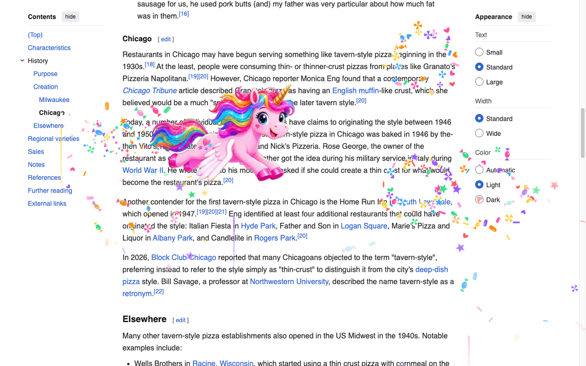

# Candy Unicorn

A Chrome extension that sends a glitter unicorn flying across the page you're reading, with candy fireworks bursting behind it. Peppermints, wrapped candies, jellybeans, stars, and hearts rain down, then the page goes back to normal.



## Features

- **Fly now:** click the toolbar icon and press Fly now for an instant show.
- **Random flights (opt-in):** after you allow it in settings, the unicorn flies in on its own, at random times or every 1 to 60 minutes.
- **Unicorn controls:** size (120 to 360 px), speed (3 to 14 seconds to cross the screen), and a sparkle trail on or off.
- **Candy fireworks:** 1 to 50 per flight, 23 by default.
- **Skip sites:** keep the unicorn off any site with one click.
- **Stays out of the way:** the animation never blocks clicks, flies only in the tab you're viewing, and pauses scheduled flights when your computer has reduce motion turned on.

## Install from source

1. Download or clone this repo.
2. Open `chrome://extensions` in Chrome.
3. Turn on **Developer mode** (top right).
4. Click **Load unpacked** and select the `extension` folder.
5. Pin Candy Unicorn from the puzzle icon in the toolbar.
6. Open any regular website, click the unicorn icon, and press **Fly now**.

Chrome blocks extensions on `chrome://` pages and the Chrome Web Store, so the unicorn skips those pages.

## Permissions

| Permission | Why the extension asks for it |
| --- | --- |
| `activeTab` | Shows the unicorn on the current tab when you press Fly now. |
| `storage` | Saves your settings in your Chrome profile. |
| `alarms` | Schedules the next random or timed flight. |
| `scripting` | Adds the animation layer to the page. |
| `<all_urls>` (optional) | Off at install. Requested only when you press "Allow random flights," so the unicorn flies in on its own. Turn it off any time from settings. |

The extension collects no data. It does not read, change, or send page content. It only draws a temporary animation layer on top of the page.

## How it was made

The unicorn started as an image and became a looping animation through a few AI and open-source tools.

**Art and animation: [ElevenLabs ElevenCreative](https://elevenlabs.io), Image & Video**
1. **GPT Image 2** generated the original unicorn illustration.
2. **Background Removal** cut the unicorn out of the scene.
3. An image edit model placed the cutout on a flat chroma key green background, with no shadow.
4. **Google Veo 3.1** animated a 4-second wing-flap loop from the green image, using the same image as the start and end frames for a seamless loop.

**Code, conversion, and store assets: [Claude](https://claude.ai) by Anthropic**
- Wrote the extension: Manifest V3 service worker, content script, canvas fireworks, and the settings popup.
- Converted the Veo clip into a transparent animated WebP using **FFmpeg**, **Python**, **NumPy**, and **Pillow**: chroma key removal, green spill cleanup, tight cropping, and 24 fps encoding.
- Tested the extension in **Chromium** with **Playwright**, including the permission flow and flight recordings.
- Built the Chrome Web Store screenshots, promo tile, and listing answers. Store graphics use the **Inter** typeface.

**Store screenshot backdrop:** the Wikipedia article on Chicago tavern-style pizza, used under [CC BY-SA 4.0](https://creativecommons.org/licenses/by-sa/4.0/).

## Repo layout

```
extension/   The Chrome extension (load this folder unpacked)
  manifest.json      Manifest V3 config, version 1.0.1
  background.js      Schedules flights and injects the animation
  content.js         Unicorn flight, sparkle trail, and candy fireworks
  defaults.js        Default settings
  popup.html/css/js  Settings panel
  unicorn.webp       Transparent animated unicorn, 24 fps loop
  icons/             Toolbar and store icons
store/       Chrome Web Store listing answers, screenshots, and promo tile
```

## Package for the Chrome Web Store

Zip the contents of the `extension` folder so `manifest.json` sits at the top level of the zip:

```
cd extension
zip -r ../candy-unicorn.zip .
```

Raise `version` in `manifest.json` before each new upload.

## Author

Ezio Magarotto, [magarottos.com](https://magarottos.com)
